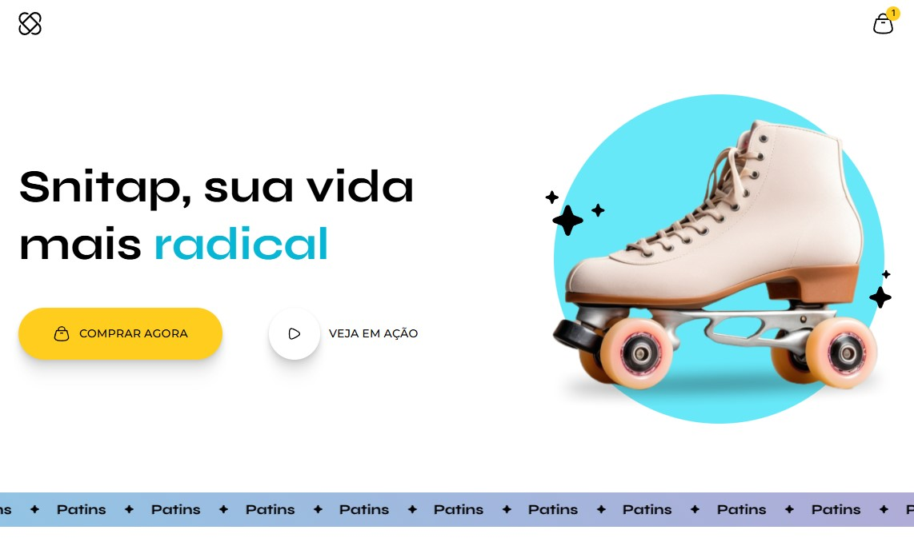
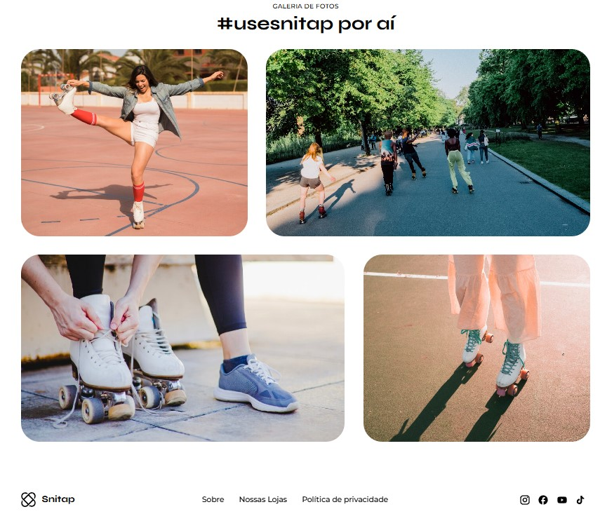

# Landing Page Animada - Snitap Patins

🔹 Um projeto desenvolvido para explorar e praticar animações e transições em CSS, criando efeitos visuais fluidos e interativos. O objetivo foi dominar keyframes, transformações, transições suaves e efeitos de hover, aplicando-os em componentes modernos para melhorar a experiência do usuário com microinterações cativantes.

## 🚀 [Ver Projeto Finalizado](https://diegocoelho-svg.github.io/Patins-Landing-Page/)

## 🖼️ Arte Finalizada
| Parte 1 | Parte 2 |
|----------|----------|
|  |  |

## 🛠 Tecnologias Utilizadas

🎨 Animações com @keyframes

🔄 Transições suaves (transition)

✨ Efeitos de hover e transformações (transform)

## 📦 Possíveis melhorias

- **📱 Responsividade Avançada**  
  Adaptar o layout para todos os tamanhos de tela (mobile, tablet, desktop)  
  - Implementar media queries específicas  
  - Ajustar animações para dispositivos móveis  

## 🎓 Créditos
Este projeto foi desenvolvido com base nos conhecimentos adquiridos através dos incríveis conteúdos educacionais da:

  

